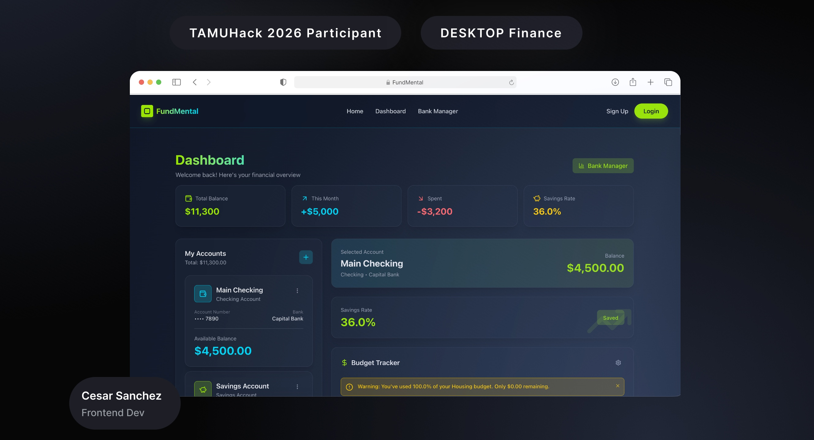

# Investment Porfolio Management Dashboard

Welcome to the project! This repository was built under a time-constraint during the **TAMUHack 2026** competition and contains the source code for our hackathon project, which was built using **React**, **Vite**, **Tailwind CSS**, and **Django**.

The people who helped build this project were the following:
- Cesar Sanchez
- Daniel Wang
- Brianna Tao

## Table of Contents
* [About the Project](#about-the-project)
  * [Built With](#built-with)
* [Getting Started](#getting-started)
  * [Prerequisites](#prerequisites)
  * [Installation](#installation)
* [Usage](#running-code)
---

## About the Project
The investment portfolio management dashboard is a web application built to better learn about Front-end and Backend development in this project. This project was created during the TAMUHack 2026 hackathon.



### Built With
* [](https://reactjs.org/)
* [](https://vitejs.dev/)
* [](https://tailwindcss.com/)
* [](https://www.python.org/)

---

## Getting Started

Follow these instructions to set up the project locally and get it running.

### Prerequisites
Make sure you have the following installed on your system:
- [Node.js](https://nodejs.org/) (v14 or higher)
- [npm](https://www.npmjs.com/) or [yarn](https://yarnpkg.com/)

### Installation
1. Clone the repository:
   ```bash
   git clone https://github.com/your-username/TAMUHack2026.git
2. Set up virtual env
3. Enter venv using
.venv\Scripts\activate.bat for windows

### Running Code
Using `Node.js`. run the following:

```zsh
npm install
npm run dev
```

This should open up the file on a Vite server which is then displayed onto a local server on your webbrowser.
